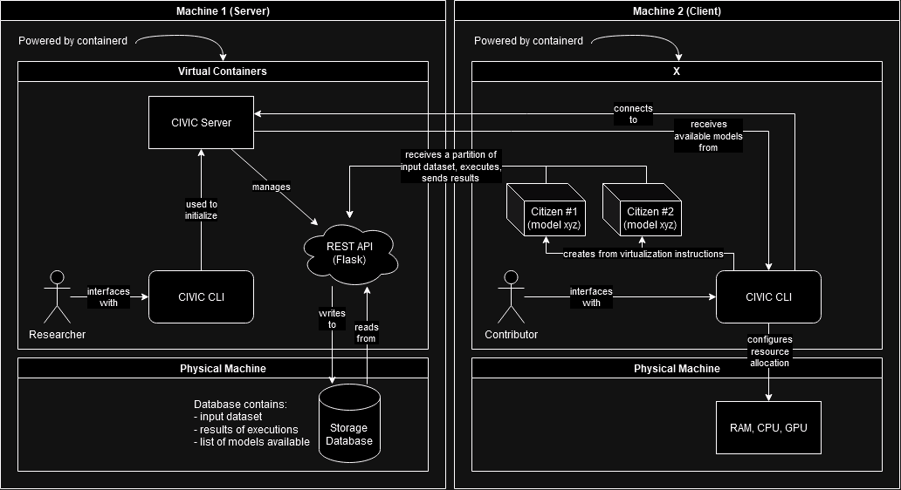

# CIVIC

- [CIVIC](#civic)
  - [Team Information](#team-information)
  - [Problem Statement](#problem-statement)
    - [Issues identified in existing solutions](#issues-identified-in-existing-solutions)
    - [Proposed flow](#proposed-flow)
    - [Benefits](#benefits)
  - [Project Outline](#project-outline)
    - [Abstract](#abstract)
    - [Terminology](#terminology)
    - [CIVIC CLI](#civic-cli)
    - [Work expected](#work-expected)
    - [Expected outcomes](#expected-outcomes)
  - [Design diagram](#design-diagram)

## Team Information

**Jack Margeson**

MEng Computer Science Student (grad. 2025)

- e: [margesji@mail.uc.edu](mailto:margesji@mail.uc.edu)
- l: [linkedin.com/in/jack-margeson/](https://www.linkedin.com/in/jack-margeson/)
- w: [marg.es/on](https://marg.es/on)

**Dr. William Hawkins III**

Asst Professor, Project Advisor

- e: [hawkinwh@ucmail.uc.edu](mailto:hawkinwh@ucmail.uc.edu)
- w: [researchdirectory.uc.edu/p/hawkinwh](https://researchdirectory.uc.edu/p/hawkinwh)

## Problem Statement

There is no user-friendly distributed computing framework that incorporates virtualization for client machines.

### Issues identified in existing solutions

- BOINC
  - Key problem: every instructional program must be–
    1. written in C/C++
    2. _be compiled for each targeted architecture_
    3. have custom made assimilators/validators
  - Several features outdated or not well documented
  - Perl front end, registration tied to a forum, unneeded
  - Admin web portal is nice, but forced to use command line for most actions
  - Testing programs is a nightmare (see: manually staging input files for download)

### Proposed flow

- First, central server sends out virtualization instructions instead of programs and files to client machines
  - Docker, Kubernetes, containerd?
- Client machine configures the virtualization size based on how many resources it's willing to allocate to the project, then spins up an instance
- Central server communicates directly with virtualization through REST calls
- Executable (note, of any type) already packaged with the virtualization instructions
- Central server sends work units to virtualization(s), receives back results of execution
- Stores result in database for future project analysis
  - Look into highest throughput databasing software... which flavour SQL?

### Benefits

- Architecture independent
- More possibilities for researchers
  - No longer have to write your code in just C/C++
  - No requirement to include framework specific headers in code
  - Utilize existing code with no to minimal changes

## Project Outline

### Abstract

Distributed computing is a design methodology that enables digital storage and data processing to be completed across multiple devices, often on separate networks. CIVIC (Central Intelligence Virtualization Instruction Cluster) provides distributed computing services by leveraging virtualization technologies to create a user-friendly framework for both researchers and participants.

The overall goal of this project is to address the limitations of current distributed computing programs and open new possibilities for research and development. Unlike existing frameworks that require specific programming languages or hardware architectures when writing applications, CIVIC provides a flexible and language/architecture-independent design.

Researchers can deploy their existing code to a CIVIC instance with minimal changes, while participants can easily contribute computational resources. This is achieved through the creation of models, a set of instructions that can be used by client machines to create virtualizations. These virtualizations, referred to as citizens, are worker containers capable of receiving fractions of input data and executing code to generate output. Each fraction of data generated by the server is called a duty, and each duty can be assigned to one or more citizens depending on the result verification needs of the project.

The CIVIC Server manages model distribution and communication with citizens, as well as processing, validating, and assimilating incoming duty results--ensuring efficient and scalable distributed computing by minimizing required human interaction.

### Terminology

- CIVIC Server: the central intelligence of the computing cluster. Responsible for connecting to client machines, sending instructions, serving input content, storing responses, and more.
- Duty/duties: a unit of work, i.e. a portion of input data given by the CIVIC Server to execute a program on (for example, calculating if there are any prime numbers between two bounds)
- Model: virtualization instructions generated server-side by the researcher. Models contain information that tell client machines running CIVIC how to build the virtual environment where duties will be performed.
- Citizen: a virtualized machine built based on a given model, responsible for connecting to the CIVIC Server and executing programs upon receiving a duty.

### CIVIC CLI

- Command line application, written in Python
  - Available as a works-out-of-the-box Docker image
- Two main use cases: developer/researcher and participant
  - As a developer/researcher:
    - Initial server setup
      - Partitioning disk space for database
      - Initializing networking for communication through REST API
    - Model creation
      - Define how citizens created from this model should run your executable(s), input and output, set validation thresholds, etc.
    - Input data segmentation
      - Configure input dataset(s) into smaller, manageable chunks
  - As a participant:
    - Connect to a server
    - Download all available models hosted for the project, choose one to contribute to
    - Configure resource allocation for virtualizations
    - Create citizens in order to process duties received from the server

### Work expected

- Creation of a command-line application that provides the outlined functionality to both researchers/developers and participants/clients
- Operation and management of the server-side application for development (database layers, REST API communication with clients)
- Creation of an example project in the built framework to illustrate operability

### Expected outcomes

- Easily executable command line program or virtual image that provides planned functionality for the project
- Fully documented design process (incl. comments in all written code, user documentation for command line options/functions)
- Final report detailing the design and structure of the framework, as well as execution results

## Design diagram

